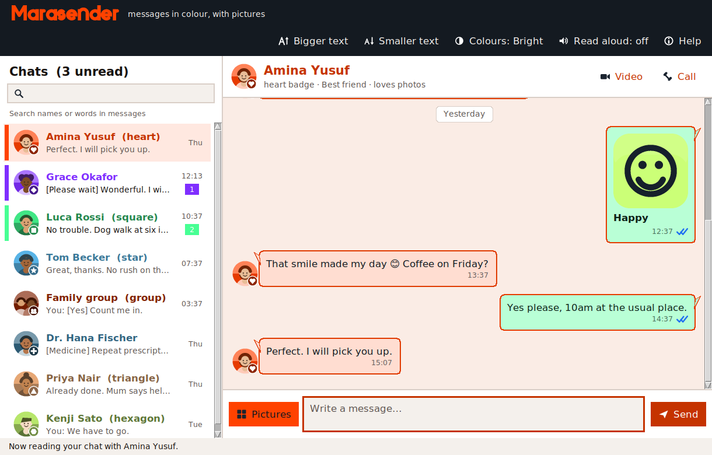
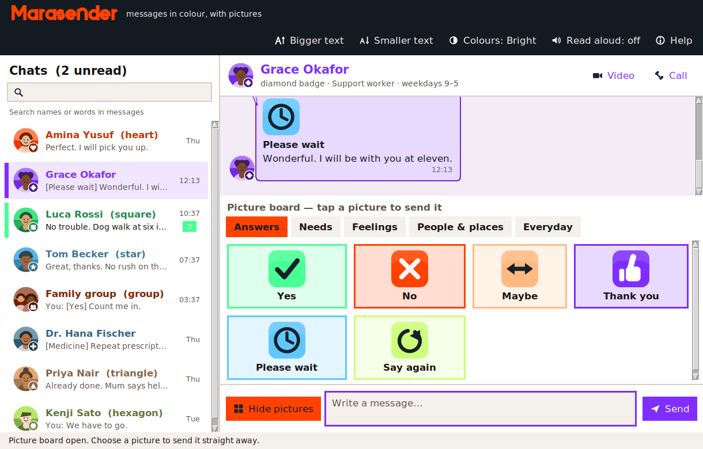
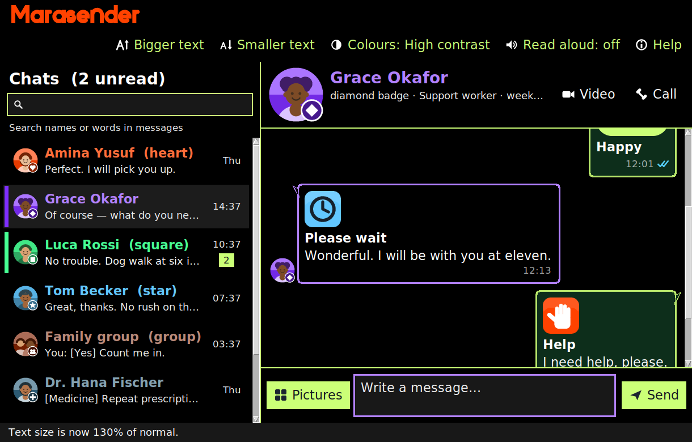

# Marasender

A WhatsApp-style messenger written in Python. It is built for people who find
a wall of grey text hard to read: **every contact has their own colour**, every
message can be a **picture**, and the whole interface can be made bigger,
darker or higher-contrast in one click.

Nothing but the Python standard library — no `pip install`, no accounts, no
network. The contacts are simulated and reply on your own machine.



## Running it

```bash
git clone https://github.com/antikomarine/Leon.git
cd Leon
python3 run.py
```

Requirements: **Python 3.9+ with Tkinter**, which is part of the standard
library. It is already there on the python.org installers for Windows and
macOS; on Linux you may need the system package:

| System | Command |
| --- | --- |
| Debian / Ubuntu / Mint | `sudo apt install python3-tk` |
| Fedora | `sudo dnf install python3-tkinter` |
| Arch | `sudo pacman -S tk` |

## What it does

* **Conversations in colour.** Eight contacts and a group chat, each with their
  own colour running through their avatar, their name, their message bubbles
  and the tint of the chat background — so you always know where you are.
* **Picture messages.** A picture board of 30 large symbols (Yes, No, Help,
  Drink, Medicine, Bathroom, It hurts, Happy, Love, Home, Doctor …) grouped
  into categories. Tapping one sends a complete, polite sentence with the
  picture attached.
* **A messenger that behaves like one.** Message bubbles with tails, day
  separators, sent/delivered/read ticks, unread badges, a typing indicator,
  search across names *and* message text, and history that is still there when
  you reopen the app.



## The palette

The whole app is built from six colours:

| | Colour | Used for |
| --- | --- | --- |
| 🟥 | `#FF4200` orange | The wordmark and the main action colour, Amina, "No", "Help", "Love" |
| 🟩 | `#47FF94` mint | Your own message bubbles, Luca, "Yes", "Home" |
| 🟪 | `#7F2EFF` violet | The keyboard focus ring, Grace, "Thank you", "Medicine", "Music" |
| 🟦 | `#62C7FF` sky | Read ticks, Tom, "Please wait", "Drink", "Call me" |
| 🟨 | `#CBFF77` lime | The high-contrast scheme, Kenji, "Happy", "Nice weather" |
| 🟧 | `#FFBA82` peach | Night-mode headings, Priya, "Maybe", "Food" |

They live in [`marasender/brand.py`](marasender/brand.py), which is the only
place any of them is written down — contacts, picture tiles and all three
colour schemes are built from those six values and darker versions of them.
Change one and rerun `python3 tools/make_assets.py`, and the contacts, symbols
and avatars all follow.

Four of the six are light colours, so no single rule like "white text on
colour" works. Nothing hard-codes the decision: `text_ink()` picks white or
near-black per colour by measuring contrast, and `readable()` lightens or
darkens a colour until it clears 4.5:1 on whatever background it lands on. That
is why the same six colours work on a white panel, on a dark one, and on pure
black.

## The name

The app is called **Marasender**, set in **Bauhaus 93** in `#FF4200` on a dark
bar.

Bauhaus 93 is Microsoft's digital cut of the Bauhaus style: ITC Bauhaus, drawn
by Ed Benguiat and Victor Caruso, which in turn descends from Herbert Bayer's
1925 *Universal* alphabet — an experiment in reducing letters to shapes you can
draw with a ruler and a compass. Microsoft ships it with Office, so it is
everywhere on Windows and almost nowhere else, and it is not free to
redistribute with this project.

So the app looks for it, then for its relatives and look-alikes, in this order:

1. `Bauhaus 93`, `ITC Bauhaus`, `Bauhaus Std`
2. **`Baumans`** — Bauhaus-inspired, free under the SIL Open Font License and
   available from Google Fonts. Install it and the app picks it up with no
   configuration; it is the easiest way to get the look without Office.
3. `Blippo Black`, `Busorama`, `Futura`, `Century Gothic`, `URW Gothic`,
   `Poppins`, `Questrial`, `Trebuchet MS`

If none of them is installed — which is the normal case on a fresh Linux or
macOS machine — the app falls back to a wordmark **drawn** on the same
principles Bayer used: circular bowls, straight stems, one monoline weight.
`tools/make_assets.py` renders it at five sizes so it keeps up with the
text-size setting:


(Tk can only use fonts the operating system already knows about — it has no way
to load a font file an application ships with — which is why the fallback is
drawn rather than bundled.)

## Built for readability and for disabled users

This is the part of the app that got the most attention.

* **Pictures everywhere, words always.** 192 generated images: avatars,
  symbols, and interface icons. No button is ever a picture on its own — each
  one carries its word next to it, plus a tooltip with the same wording.
* **Never colour alone.** Every contact also has a *badge shape* — heart,
  square, triangle, star, diamond, hexagon, cross, group — stamped on their
  avatar and named next to their name, so colour-blind users have a second,
  independent cue.
* **Text size in seven steps**, from 90% to 200%, applied to every word in the
  app at once. The layout reflows: the conversation list widens, message
  bubbles rewrap, the toolbar wraps onto extra lines, and long names are
  shortened with an ellipsis rather than overlapping.
* **Three colour schemes** — Bright (colours at full strength), Night (where
  these colours glow) and High contrast (black and lime with thick outlines).
  All three keep the dark app bar, so the orange wordmark reads the same way in
  each of them. Every text/background pair in every scheme is tested to meet the
  WCAG AA contrast ratio of 4.5:1, and contact colours are automatically
  lightened or darkened until they are readable on whichever background they
  land on.
* **Read aloud.** New messages, and any message you click, can be spoken using
  the speech tool the machine already has (`say` on macOS, `espeak`/`spd-say`
  on Linux, SAPI on Windows). If none is installed, the button explains that
  instead of failing.
* **Full keyboard access.** Everything — conversations, picture tiles, buttons
  — takes focus with Tab and activates with Enter or Space, and whatever has
  focus is outlined in a bright ring.
* **A running commentary.** The bar along the bottom says what just happened
  ("New message from Luca Rossi: …", "Text size is now 150% of normal"), so
  nothing changes silently.



## Keyboard shortcuts

| Keys | What it does |
| --- | --- |
| `Enter` | Send the message |
| `Shift` + `Enter` | Start a new line |
| `Ctrl` + `B` | Open or close the picture board |
| `Ctrl` + `K` | Jump to search |
| `Ctrl` + `+` / `Ctrl` + `-` | Bigger or smaller text |
| `Ctrl` + `T` | Next colour scheme |
| `Ctrl` + `R` | Read the last message aloud |
| `Ctrl` + `↑` / `Ctrl` + `↓` | Previous or next conversation |
| `F1` | Help |
| `Escape` | Close the picture board |

## How it is put together

```
run.py                     Start here
marasender/
  app.py                   The main window and everything it coordinates
  theme.py                 The three palettes, fonts and text scaling
  brand.py                 The six colours everything else is built from
  colorutil.py             Contrast maths (WCAG), shared with the art tools
  models.py                Messages, chats and the JSON store
  people.py                The address book: colours, badges, personas
  pictograms.py            The picture vocabulary of the picture board
  bots.py                  What the simulated contacts say back
  assets.py                Loads the PNGs into Tk images
  speech.py                Optional read-aloud
  textutil.py              Ellipsis helper
  widgets/
    sidebar.py             Conversation list
    chatview.py            Message bubbles, drawn on a canvas
    composer.py            The message box, Send and Pictures buttons
    pictureboard.py        The picture board
    buttons.py             Picture-and-word buttons, focus rings, tooltips
    flowbar.py             A button row that wraps when the text grows
    scrollframe.py         Scrollable container with wheel support
assets/                    197 generated PNGs (committed), wordmark included
tools/
  rasterizer.py            A tiny anti-aliased drawing library + PNG writer
  make_assets.py           Draws every avatar, symbol and icon
  make_screenshots.py      Regenerates the pictures in this README
tests/test_marasender.py    48 tests
```

### The artwork

There are no third-party images and no image library. `tools/rasterizer.py` is
a small supersampled rasteriser (circles, polygons, strokes, arcs, rounded
rectangles) that writes PNGs with `zlib` and `struct`, and
`tools/make_assets.py` draws every avatar, symbol and icon with it. To change a
colour or add a symbol, edit `marasender/pictograms.py` (or the drawing
functions) and run:

```bash
python3 tools/make_assets.py
```

## Tests

```bash
python3 -m unittest discover -s tests -v
```

They cover the data model and its persistence, the reply rules, the ellipsis
helper, the presence of every image the app asks for (the wordmark included),
that every contact and every tile is drawn from the six brand colours — and
that no two tiles seen side by side share one — and the contrast of every
colour pair in every palette, the app name against its bar included.

The tests that open a window (sending messages, switching palettes and text
sizes, the picture board, search, and that the name appears either in a font or
as the drawn wordmark) skip themselves automatically when there is no display.

## Where your messages are kept

In `~/.marasender/chats.json`. Delete that file to start again from the demo
conversations, or point `MARASENDER_HOME` somewhere else to keep them elsewhere.

## Scope

The contacts are simulated: replies are generated on your own computer, and
nothing is sent anywhere. The Call and Video buttons are there to make the app
feel familiar, and say so when pressed.
